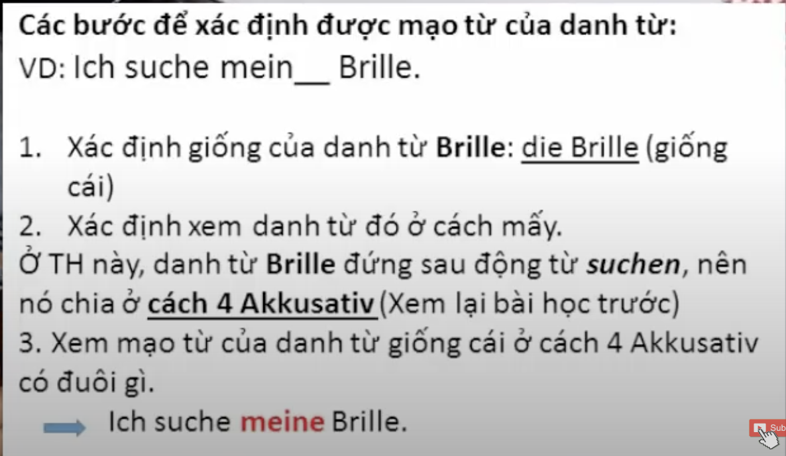
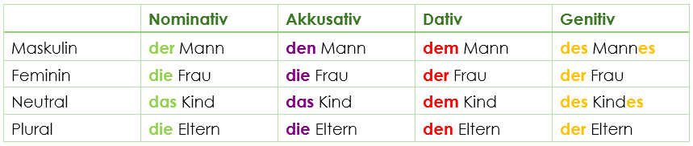
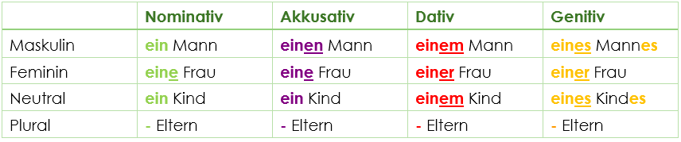
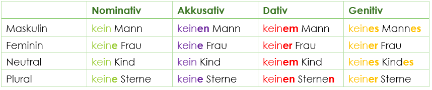
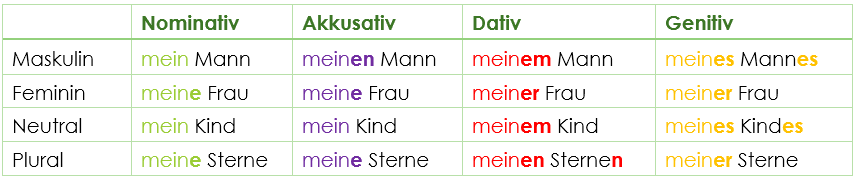

Bước 3, sử dụng các qui tắc sau:
* Bestimmter Artikel:  
    
* Unbestimmter Artikel:  
    
* Kein:  
    
* Possessivartikel:  
    

Short:
* Nomi: R - E - S - E
* Akku: N - E - S - E
* Dativ: M R M N - Mơ Rồi Mơ Nữa / Mang Ra Miền Nam
* Genitiv: S R S R - Sao Rồi Sao Rồi / Sầu Riêng Sáu Ri