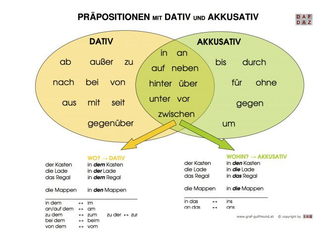

[4 cách trong tiếng Đức](https://wetalent.edu.vn/4-bien-cach-trong-tieng-duc/)  
[Chia đuôi tính từ trong tiếng Đức](https://dattrandeutsch.com/ngu-phap/die-deklination-des-adjektivs-chia-duoi-tinh-tu-a2/)  
[Adjektivdeklination Typ1 - bestimmten artikel](https://mein-deutschbuch.de/adjektivdeklination-nach-bestimmten-artikel.html)  
[Adjektivdeklination Typ2 - unbestimmten artikel](https://mein-deutschbuch.de/adjektivdeklination-mit-dem-unbestimmten-artikel.html)  
[Adjektivdeklination Typ3 - null artikel](https://mein-deutschbuch.de/adjektivdeklination-nach-nullartikel.html)  
[So sánh bằng, hơn, nhất](https://dattrandeutsch.com/ngu-phap/steigerung-der-adjektive-sanh-bang-sanh-hon-sanh-nhat-cua-tinh-tu-a2/)  

