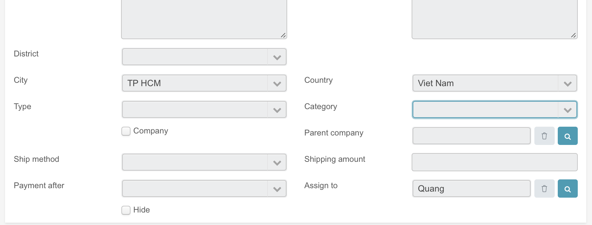
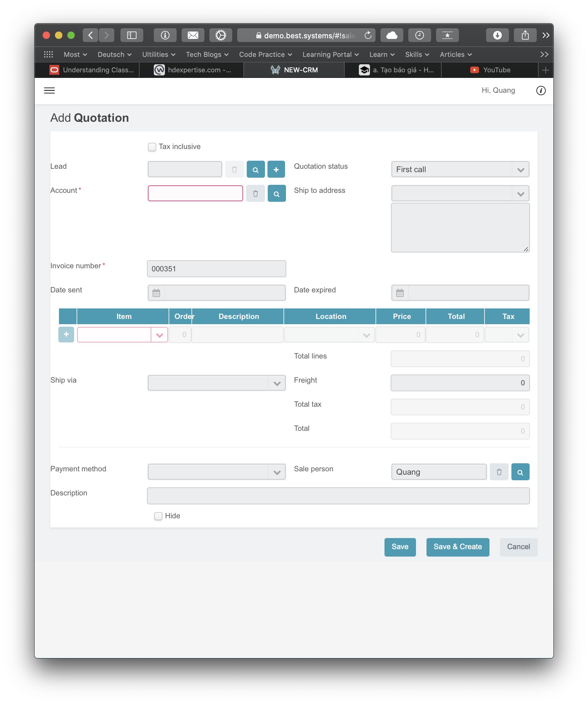
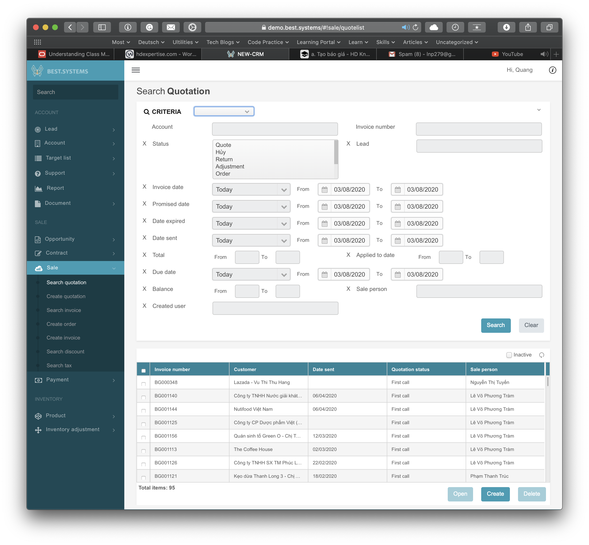

# 1. Demo có những tính năng gì?

## Lead: KH tiềm năng

### Search lead

- Shows all leads
- Open
- Create
- Convert a lead to account
- Send email
- Delete

### Create Lead

Create lead with informaton.

A lead can be assigned to a staff.

### Detail Lead

- Edit
- History log: edit history of this customer
- Send email (generate template fail, use without template -> unreachable)
- Convert: from Lead to Account

Open/Create/Delete:

- Task
- Note
- Contact
- Quotation
- Opportunity
- Support
- Target list

## Account: KH

Same as Lead but with following additions:

Open/Create/Delete:

- Invoice
- Contract
- Document:
- Payment:

Tổ chức công ty tổng và con

## Target list

### Email marketing

List composed marketing emails. You can:

- Search
- Open
- Create
- Delete

### Search target list

Show a list of marketing informations, it assigned to a group of customers. You can

- Search

- Open
- Create 
- Delete

Detail Target list:

- Edit Target list information

- Add Lead
- Add Account
- Add Contact

## Support: 

### Search support

Show all supports with custom filters. You can:

- Open
- Create
- Mass update
- Delete

### ### Detail Suport

Edit: assign to, add solution, edit status

Open/Create/Delete:

- Task
- Note
- Document

### Create support

## Document: Search/Create

## Opportunity

### Search Opportunity

Show all opportunities with custom filters. You can:

- Open
- Create
- Convert
- Mass update
- Delete

### Create Opportunity

## Contract:

- Search
- Create

## Sale

- Search quotation

- Create quotation:

- Search invoice

- Create order

- Create invoice

- Search discount

  - Create discount:

- Search tax

  - Create tax: 

## Payment:

- Search
- Create

## Product:

- Search
- Create

## Inventory Adjustment

### Search inventory adjustment

Show a list of inventory adjustments.

Search with filter. Open. Create. Delete.

### Create inventory adjustment

Type: nhập, chuyển, hư hỏng, khác

### Location

Search with filter. Open. Create. Delete.

# 2. Làm sao để tìm kiếm object?

Object có các trường của riêng nó. Mình tìm kiếm dựa trên thông tin về các trường.

Object Quotation:

Searching Quotation:

# 3. Lam sao de edit mot object. View va Edit khac gi nhau

- To edit an object, we need to open it first (by searching, or listed somewhere). A view of object will be shown, in this view, it contains "Edit" button. Hit this button, you'll switch to Edit mode.

- View mode provides a read-only summary of the information, not all fields are displayed. Edit mode provides read and write permissions, all fields are displayed and editable.

1. Demo có những tính năng gì?

   - Là phần mềm quản lý mối liên hệ với khách hàng: Lưu thông tin khách hàng. Quản lý support của khách hàng, note của nhân viên với khách hàng, tổ chức nhóm khách hàng (công ty mẹ/con), gửi nhiều email cho nhiều người cùng lúc với khả năng cá nhân hoá đối với từng khách hàng.

   - Sale: Quản lý báo giá, hoá đơn, thuế, giảm giá....

   - Là phần mềm quản lý kho: Xuất / Nhập / Báo cáo hư hỏng/mất mát. Quản lý sản phẩm

2. Lam sao de tim kiem mot object?

   Object có các trường của riêng nó. Tìm kiếm dựa trên thông tin mong muốn về các trường.

3. Lam sao de edit mot object. View va Edit khac gi nhau?

   - Để chỉnh sửa một object, mình cần phải mở nó trước (bằng cách tìm kiếm, hoặc được liệt kê ở đâu đó). Một view của object sẽ được hiện ra, trong view này, nó chứa nút "Edit". Nhấn nút Edit, nó sẽ chuyển sang chế độ Edit.

   - View mode chỉ hiển thị thông tin read-only, các trường có thể không hiện đầy đủ. Với edit, tất cả các trường được hiển thị và có thể chỉnh sửa.

