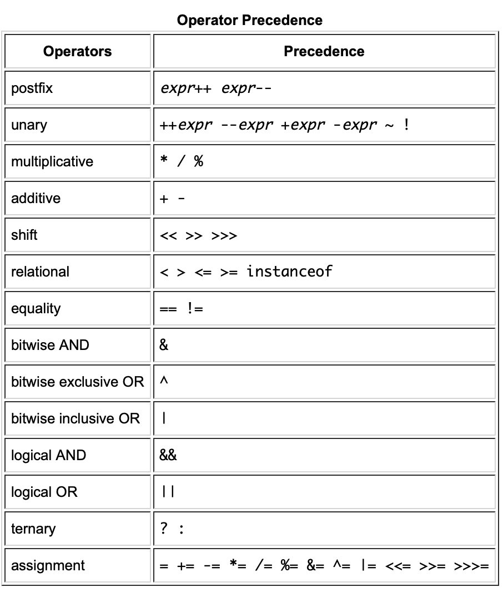

# Operators



# Summary of Operators

The following quick reference summarizes the operators supported by the Java programming language.

## Simple Assignment Operator

```
=       Simple assignment operator
```

## Arithmetic Operators

```
+       Additive operator (also used
        for String concatenation)
-       Subtraction operator
*       Multiplication operator
/       Division operator
%       Remainder operator
```

## Unary Operators

```
+       Unary plus operator; indicates
        positive value (numbers are 
        positive without this, however)
-       Unary minus operator; negates
        an expression
++      Increment operator; increments
        a value by 1
--      Decrement operator; decrements
        a value by 1
!       Logical complement operator;
        inverts the value of a boolean
```

## Equality and Relational Operators

```
==      Equal to
!=      Not equal to
>       Greater than
>=      Greater than or equal to
<       Less than
<=      Less than or equal to
```

## Conditional Operators

```
&&      Conditional-AND
||      Conditional-OR
?:      Ternary (shorthand for 
        if-then-else statement)
```

## Type Comparison Operator

```
instanceof      Compares an object to 
                a specified type 
```

## Bitwise and Bit Shift Operators

```
~       Unary bitwise complement
<<      Signed left shift
>>      Signed right shift
>>>     Unsigned right shift
&       Bitwise AND
^       Bitwise exclusive OR
|       Bitwise inclusive OR
```