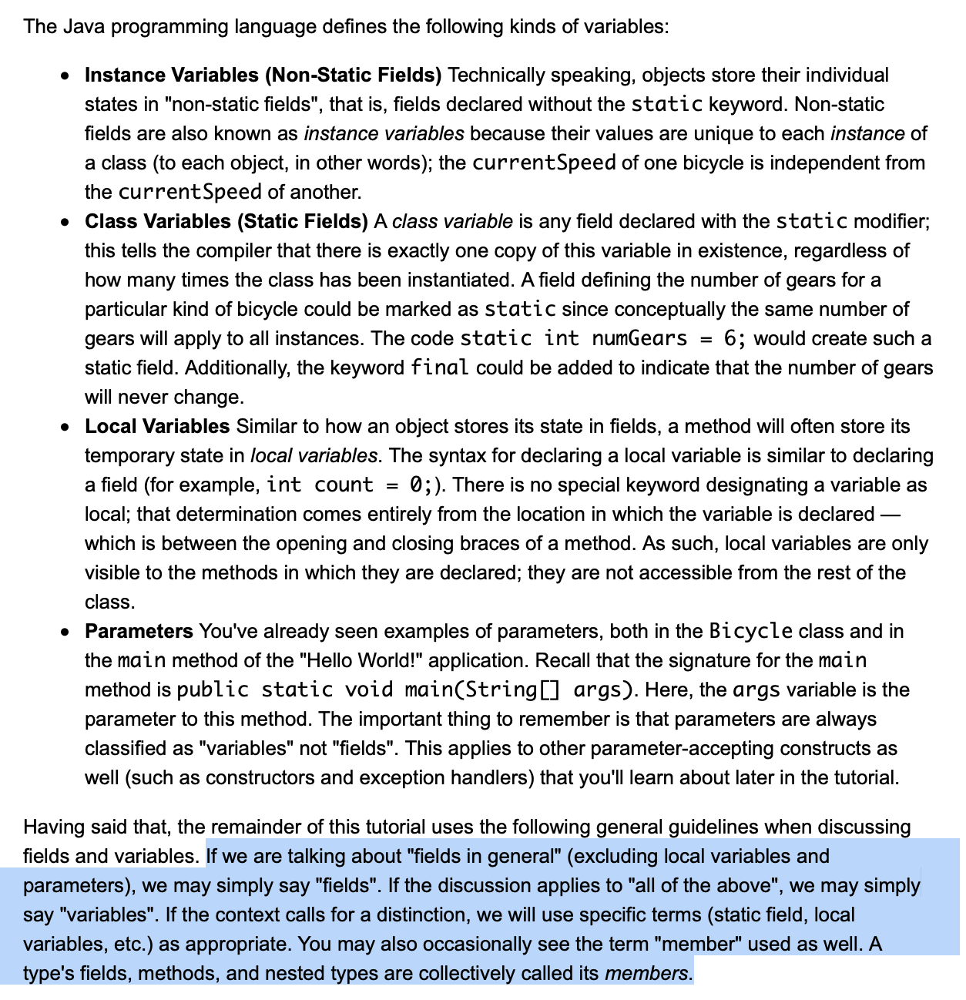

# Variables



## Primitive Data Types

- byte < short < int < long: 8, 16, 32, 64 bits

- float < double: 32, 64
- String is special, String objects technically not primitive.

### Default Values

- Fields that are declared but not initialized will be set to a reasonable default by the compiler.

- Local variables are slightly different; the compiler never assigns a default value to an uninitialized local variable. 

- If you cannot initialize your local variable where it is declared, make sure to assign it a value before you attempt to use it. 
- Accessing an uninitialized local variable will result in a compile-time error.

### Interger Literals

An integer literal is of type `long` if it ends with the letter `L` or `l`; otherwise it is of type `int`.

The prefix `0x` indicates hexadecimal and `0b` indicates binary:

```
// The number 26, in decimal
int decVal = 26;
//  The number 26, in hexadecimal
int hexVal = 0x1a;
// The number 26, in binary
int binVal = 0b11010;
```

### Floating-Point Literals

 `float` if it ends with the letter `F` or `f`; `double` can **optionally** end with the letter `D` or `d`.

 (`float` and `double`) can also be expressed using E or e.

### Character and String Literals

Literals of types `char` and `String` may contain any Unicode (UTF-16) characters. If your editor and file system allow it, you can use such characters directly in your code. If not, you can use a "Unicode escape".

Unicode escape sequences may be used elsewhere in a program (such as in field names, for example), not just in `char` or `String` literals.

There's also a special `null` literal that can be used as a value for any reference type. `null` may be assigned to any variable, except variables of primitive types.

Finally, there's also a special kind of literal called a *class literal*, formed by taking a type name and appending "`.class"`; for example, `String.class`. This refers to the object (of type `Class`) that represents the type itself.

### Using Underscore Characters in Numeric Literals

In Java SE 7 and later, any number of underscore characters (`_`) can appear anywhere between digits in a numerical literal. This feature enables you, for example, to separate groups of digits in numeric literals, which can improve the readability of your code.

```java
long creditCardNumber = 1234_5678_9012_3456L;
long socialSecurityNumber = 999_99_9999L;
float pi =  3.14_15F;
long hexBytes = 0xFF_EC_DE_5E;
long hexWords = 0xCAFE_BABE;
long maxLong = 0x7fff_ffff_ffff_ffffL;
byte nybbles = 0b0010_0101;
long bytes = 0b11010010_01101001_10010100_10010010;
```

## Arrays

```java
// declares an array of integers
int[] anArray;

// allocates memory for 10 integers
anArray = new int[10];
           
// initialize first element
anArray[0] = 100;

// accessing array
System.out.println("Element 1 at index 0: " + anArray[0]);
```

### Array declaration

An array declaration has two components: **the array's type** and **the array's name**.

- An array's type is written as `type[]`, where `type` is the data type of the contained elements; the brackets are special symbols indicating that this variable holds an array. The size of the array is not part of its type (which is why the brackets are empty).

- An array's name can be anything you want, it must follow naming conventions.

For example: `int[] anArray`. You can also place the brackets after the array's name: `int anArray[]`

### Creating an Array

**Array creation**: `anArray = new int[10]` allocates an array with enough memory for 10 integers elements and assigns the array to the `anArray` variable.

*If you skip this creation, you will see this error: `Variable anArray may not have been initialized.`*

### Multidimensional array

In Java, rows in multidimensional array are allowed to **vary** in length. For example:

```java
String[][] names = {
            {"Mr. ", "Mrs. ", "Ms. "},
            {"Smith", "Jones"}
```

### Copying Arrays

The `System` class has an `arraycopy` method that you can use to efficiently copy data from one array into another:

```java
public static void arraycopy(Object src, int srcPos,
                             Object dest, int destPos, int length)
```

### Array Manipulations

Java SE provides several methods for performing array manipulations (common tasks, such as copying, sorting and searching arrays) in the [`java.util.Arrays`](https://docs.oracle.com/javase/8/docs/api/java/util/Arrays.html) class.

Some other useful operations provided by methods in the `java.util.Arrays` class, are:

- Searching an array for a specific value to get the index at which it is placed (the `binarySearch` method).
- Comparing two arrays to determine if they are equal or not (the `equals` method).
- Filling an array to place a specific value at each index (the `fill` method).
- Sorting an array into ascending order. This can be done either sequentially, using the `sort`method, or concurrently, using the `parallelSort` method introduced in Java SE 8. Parallel sorting of large arrays on multiprocessor systems is faster than sequential array sorting.

# Summary of Variables

The Java programming language uses both "fields" and "variables" as part of its terminology. Instance variables (non-static fields) are unique to each instance of a class. Class variables (static fields) are fields declared with the `static` modifier; there is exactly one copy of a class variable, regardless of how many times the class has been instantiated. Local variables store temporary state inside a method. Parameters are variables that provide extra information to a method; both local variables and parameters are always classified as "variables" (not "fields"). When naming your fields or variables, there are rules and conventions that you should (or must) follow.

The eight primitive data types are: byte, short, int, long, float, double, boolean, and char. The [`java.lang.String`](https://docs.oracle.com/javase/8/docs/api/java/lang/String.html) class represents character strings. The compiler will assign a reasonable default value for fields of the above types; for local variables, a default value is never assigned. A literal is the source code representation of a fixed value. An array is a container object that holds a fixed number of values of a single type. The length of an array is established when the array is created. After creation, its length is fixed.