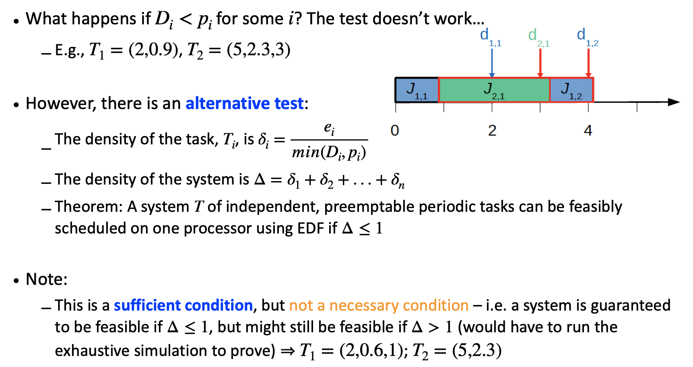
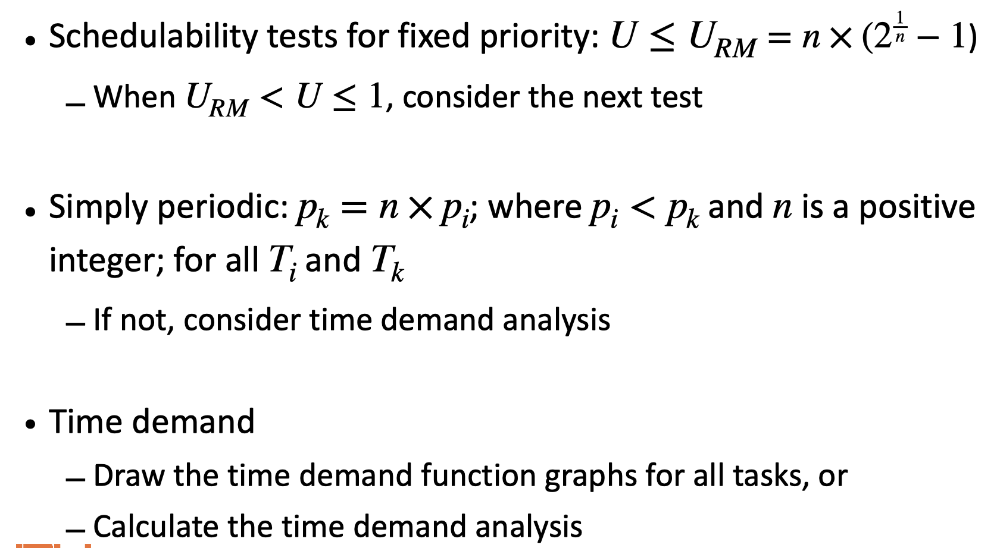
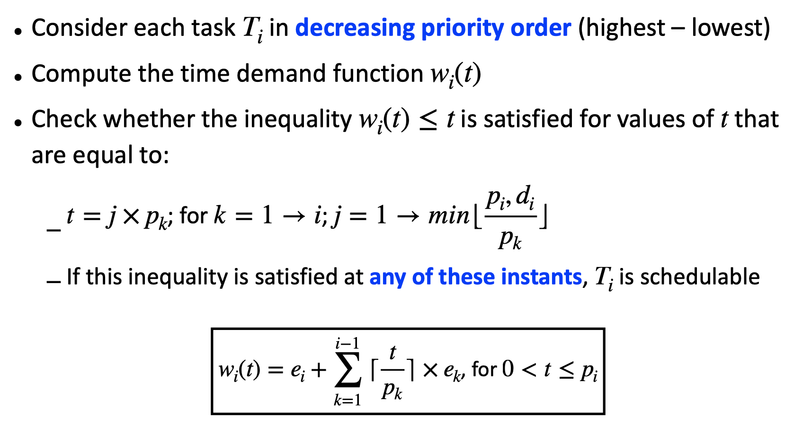
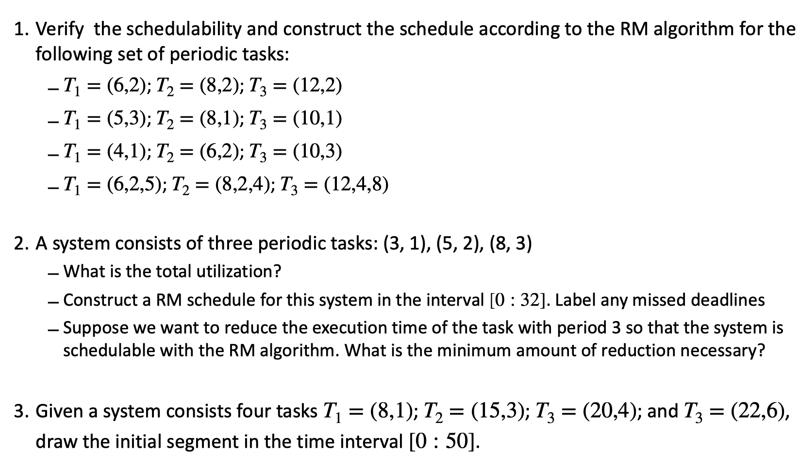
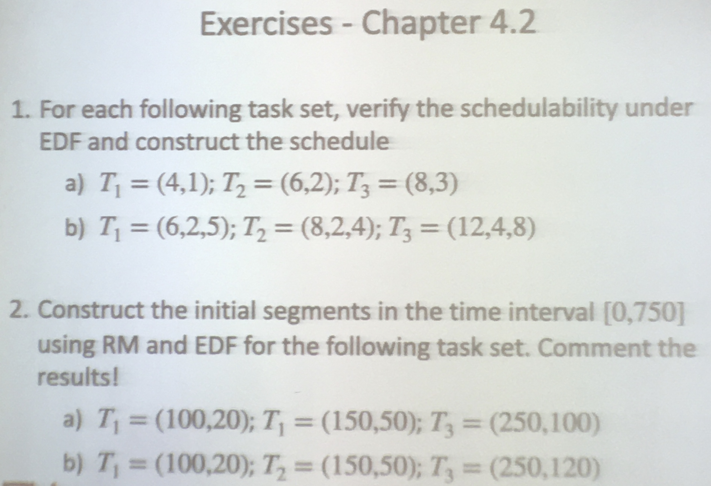
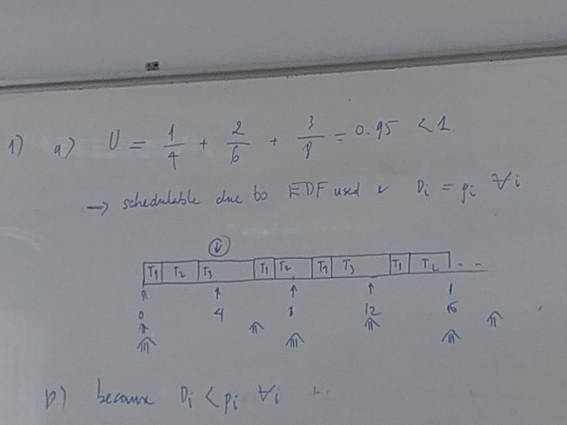
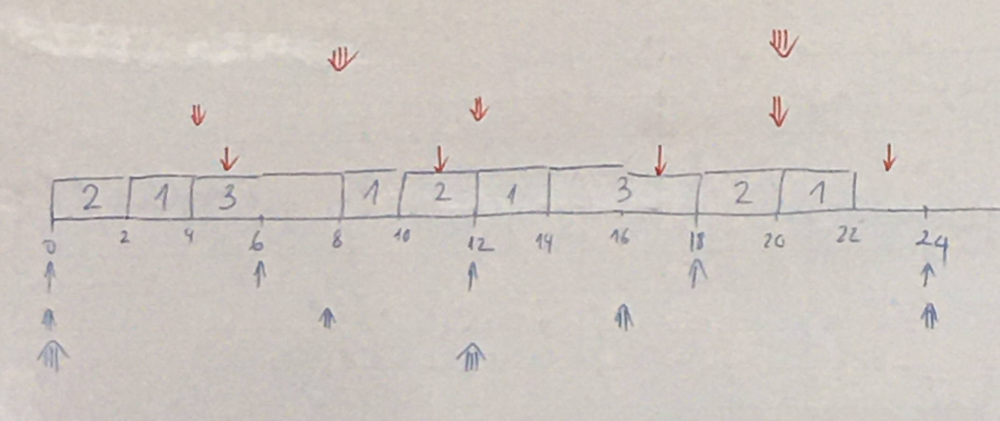
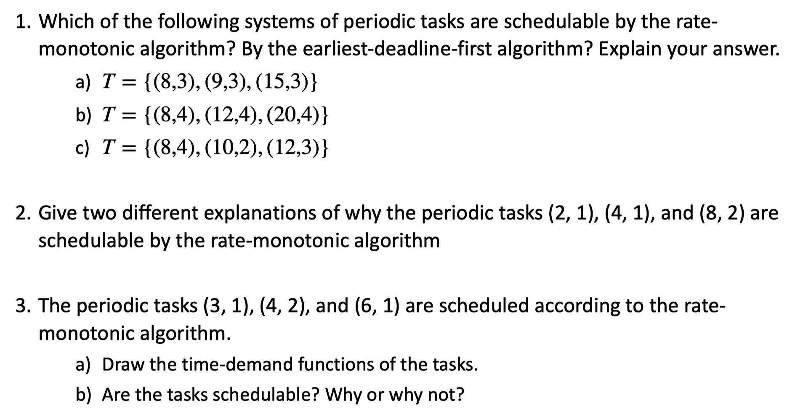

# `Chapter 4 - Review`
## `Schedulable utilization: EDF`

## `Check schedulability task: ` 

## `Time demand function`

#### `Example`

## `Time demand analysis`

## `Example`

### Alternative solution

## `Exercises Chapter 4.1`

### `Solution`
#### 1. 
#### 2.
- a
- b
- J(3,1) bị trễ deadline 1 đơn vị thời gian => Điều chỉnh schedule bên trên sao cho J(3,1) được thực hiện trước 1 đơn vị thời gian => Giảm execution time của T1 hoặc T2. Đề bài yêu cầu điều chỉnh T1, and there exists 3 jobs from the task T1 and we need 1 unit of time available in the interval from 0 to 8 => The task T1 needs to be reduced at least 1/3 unit of execution time.
=> New execution time e1 = 2/3 = 0.667, delta_1 = 0.33
#### 3. 

## `Exercises Chapter 4.2`

### `Solution`
#### 1. 
##### a.

##### b.
* Because D_i < p_i for all i => Density test  
* Delta = 2/5 + 2/4 + 4/8 = 1.4 > 1 => might still be feasible (see schedulable utilization: EDF)  
* Run exhaustive simulation to prove

#### 2. 

##### a.

**RM:**

Note, the third task (the blue one) runs past its deadline from t = 250 to t = 260.

**EDF**

There are no missed deadlines in this schedule.

##### b.
RM
  

The third task (the blue one) runs past its deadline from 250 to 280 and from 520 to 560. The third task will continue to be backlogged farther and farther each time a new job in the task is released, but the first and second task are not affected.

**EDF**

Task 2 eventually misses its deadline. Once jobs start missing deadlines, almost every job is going to miss its deadline.

## `Exercises Chapter 4.3`

### `Solution`
#### 1.

a. T = {(8, 3), (9, 3), (15, 3)}

**Sol:  URM(3) ≈ 0.780** 

**U = 3/8 + 8/9 + 3/15 = 0.908 > URM
schedulable utilization test is indeterminate. For RM, shortest period is highest priority**
**w1(t) = 3, W1 = 3 ≤ 8, ∴ T1 is schedulable
w2(t) = 3 + ⌈t/8⌉⋅3 = t
W2 = 6 ≤ 9, ∴ T2 is schedulable
w3(t) = 3 + ⌈t/8⌉⋅3 + ⌈t/9⌉⋅3 = t
W3 = 15 ≤ 15, ∴ T3 is schedulable.**
**All tasks are schedulable under RM, therefore the system is schedulable under RM.**
**U ≤ 1, ∴ the system is schedulable under EDF****

b. T = {(8, 4), (12, 4), (20, 4)}

**U = 4/8 + 4/12 + 4/20 ≈ 1.03 > 1
∴ this system is not schedulable by any scheduling algorithm**

c. T = {(8, 4), (10, 2), (12, 3)}

**U = 4/8 + 2/10 + 3/12 = 0.95 > U****RM(3)**
**Schedulable utilization test is indeterminate, use time-demand analysis,
w1(t) = 4, W1 = 4 ≤ 8
∴ T1 is schedulable
w2(t) = 2 + ⌈ t/8 ⌉⋅4 = t
W2 = 6 ≤ 10
∴ T2 is schedulable
w3(t) = 2 + ⌈ t/8 ⌉⋅4 + ⌈ t/10 ⌉⋅2 = t
W3 = 15 > 12
∴T3 misses its deadline**
**This system is not schedulable under RM**
**U ≤ 1 ∴ this system is schedulable under EDF**

#### 2. http://targetiesnow.blogspot.com/2013/11/real-time-system-by-jane-w-s-liu_2.html
#### 3. 

a.

 

b.  No. Based on the Time Demand Function graph, Task 3 did not touch or go below the dash line by its deadline at time 6. In another word, it can not meet its deadline and therefore not schedulable.

