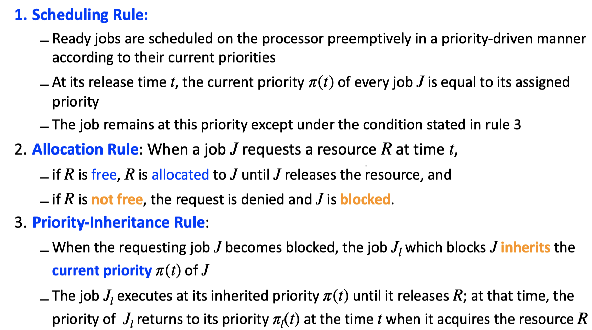

# Chapter 5: Resource access control protocols
In previous chapters, we ignores resources for scheduling processors. From this chapter, along with processors, additional **resources are required for jobs to be executed**.  
**Resources:** hardware devices, disk, memory, software resources (mutexes, locks, queues...)  
**Aims of this chapter:**
- How **resource contention** **affects** the **execution** behavior and **schedulability** of jobs 
- How **various resource access-control protocols** work to **reduce the undesirable effect** of resource contention 
- **How well these protocols succeed** in achieving this goal

## Definitions & Notations 

### Locks

### Critical sections

The segment (khúc) of a job that begins at a lock and ends at a matching unlock is a critical section.

- Use the **expression [R, n; e]** to **represent** a **critical section** regarding **n units of R**, with the critical section **requiring e units of execution time** 
- Critical sections may nest if a job needs multiple simultaneous resources

### Conflict & Blocking

Two jobs **conflict** with one another if some of the **resources** they **require** **are** of **the same** type

- They contend for a resource if one job requests a resource that the other job has already been granted

When the scheduler **does not grant** $n_k$ units of resource $R_k$ to the job requesting them, the lock request $L(R_k , n_k )$ of the job fails (or is denied)

- The job is blocked and loses the processor 
- The job is unblocked when the scheduler grants it $n_k$ units of resource $R_k$ 

### Example

### Resource access control

A resource access-control protocol, or simply an access-control protocol, is a **set of rules** that govern:

- when and under what conditions each request for resource is granted and 
- how jobs requiring resources are scheduled.

More detail the undesirable effects of resource contention:

- **Priority inversion**: occurs when a **low-priority job executes** while some **ready higher-priority job waits**

  ****

- **Time anomalies**

  

- **Deadlock**: Job 1 bị khoá bởi Job 2, Job 1 chờ job 2 chạy xong rồi tới luợt nó, nhưng Job 2 lại bị khoá bởi job 1 => Khoá lẫn nhau = Deadlock

  

## Resource access control protocols
- Non-preemptable Critical Sections - NPCS 
- Priority inheritance protocol
  - **The priority-ceiling protocol** extends the **priority-inheritance protocol** to **prevent deadlocks** and to **further reduce the blocking time**
- Basic priority ceiling protocol 
  - This has led to **two modifications** to the protocol:
    - The **stack-based priority ceiling protocol**
    - The **ceiling priority protocol**
- Stack-based priority ceiling protocol
- The ceiling priority protocol (in dynamic priority systems) (không thi)

(Bên dưới chưa phân loại)
## Đề bài :

## Non-preemptive critical sections

When **a jobs** **acquires** a **resource** it is **scheduled** with **highest priority** in a **nonpreemptable** manner

**Deadlock** can **never** **occur**

## Basic priority inheritance protocol

### Properties
Properties of the Priority-inheritance Protocol
- Simple to implement, does not require prior knowledge of resource requirements 
- Jobs exhibit different types of blocking
  - Direct blocking due to resource locks 
  - Priority-inheritance blocking 
  - Transitive blocking
- Deadlock is not prevented
  - Although it can be prevented by using additional protocols in parallel
- Can reduce blocking time compared to non-preemptable critical sections, but does not guarantee to minimize blocking

### Rule

### Steps to schedule
- Schedule with algorithm
- Whenever resources needed, use the protocol to grant the resources: use rule 2
  - If there is any job blocked: use rule 3
- Whenever resource released, use rule 3 to return priorities

### Example:

### Complex example

1. At time 0, job J 5 becomes ready and executes at its assigned priority 5. At time 1, it is granted the resource Black.
2. At time 2, J 4 is released. It preempts J 5 and starts to execute.
3. At time 3, J 4 requests Shaded. Shaded, being free, is granted to the job. The job continues to execute.
4. At time 4, J 3 is released and preempts J 4 . At time 5, J 2 is released and preempts J 3 .
5. At time 6, J 2 executes L(Black) to request Black; L(Black) fails because Black is in use by J 5 . J 2 is now directly blocked by J 5 . According to rule 3, J 5 inherits the priority 2 of J 2 . Because J 5 ’s priority is now the highest among all ready jobs, J 5 starts to execute.
6. J 1 is released at time 7. Having the highest priority 1, it preempts J 5 and starts to execute.
7. At time 8, J 1 executes L(Shaded), which fails, and becomes blocked. Since J 4 has Shaded at the time, it directly blocks J 1 and, consequently, inherits J 1 ’s priority 1. J4  now has the highest priority among the ready jobs J 3 , J 4 , and J 5 . Therefore, it starts to execute.
8. At time 9, J 4 requests the resource Black and becomes directly blocked by J 5 . At this time the current priority of J 4 is 1, the priority it has inherited from J 1 since time 8. Therefore, J 5 inherits priority 1 and begins to execute.
9. At time 11, J 5 releases the resource Black. Its priority returns to 5, which was its priority when it acquired Black. The job with the highest priority among all unblocked jobs is J 4 . Consequently, J 4 enters its inner critical section and proceeds to complete this and the outer critical section.
10. At time 13, J 4 releases Shaded. The job no longer holds any resource; its priority returns to 4, its assigned priority. J 1 becomes unblocked, acquires Shaded, and begins to execute.
11. At time 15, J 1 completes. J 2 is granted the resource Black and is now the job with the highest priority. Consequently, it begins to execute.
12. At time 17, J 2 completes. Afterwards, jobs J 3 , J 4 , and J 5 execute in turn to completion.

## Basic priority ceiling protocol

The priority-ceiling protocol **extends the priority-inheritance protocol** to **prevent deadlocks** and to further **reduce the blocking time**

Key assumptions:

- The **assigned priorities** of all jobs are **fixed** (e.g. RM scheduling, not EDF) 
- The resources required by all jobs are **known a priori**

##### Two additional terms:

- **Priority ceiling** of resource $R_k$ = highest priority of all the jobs that require $R_k$. Denoted by: $Π(R_k)$
- Vào thời điểm t bất kỳ, **current priority ceiling** $Π(t)$ of the system = **highest priority ceiling** of *in-use* resources at time t.
- If all resources are free, $Π(R_k)$ = Ω (a nonexistent priority level that is lower than the lowest priority level of all jobs)

#### Rules:

#### Example

#### Note

If resource access in a system of preemptable, fixed priority jobs on one processor is controlled by the priority-ceiling protocol:

- Deadlock can never occur 
- A job can be blocked for at most the duration of one critical section
  - There is no transitive (bắc cầu) blocking under the priority-ceiling protocol

#### Differences between the priority-inheritance and priority-ceiling protocols:

Priority inheritance is greedy, while priority ceiling is not

- The priority ceiling protocol may withhold access to a free resource, causing a job to be blocked by a lower-priority job which does not hold the requested resource 
  -  termed avoidance blocking
- The priority ceiling protocol forces a fixed order onto resource accesses, thus eliminating deadlock

#### Deadlock avoidance example

### Improve the priority ceiling protocol

#### Stack-based priority ceiling protocol

#### Rules:

##### Example

$π(R_1) = 1; π(R_2) = 2$ 

#### Note: 

nó cần resource, cần thì cấp dựa theo ceiling của system, không được thì thôi, không xảy ra chuyện block => không có inherit.

#### More example:

#### Solution

#### Deadlock avoidance

