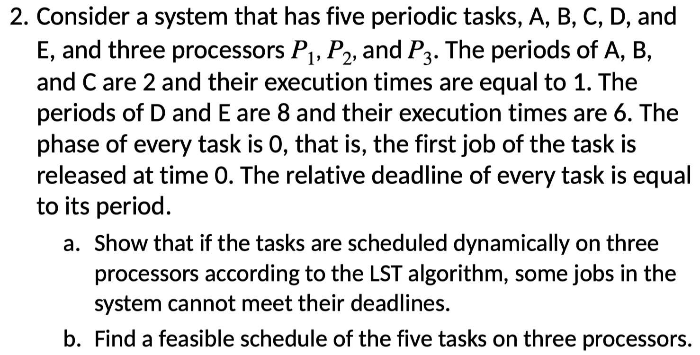
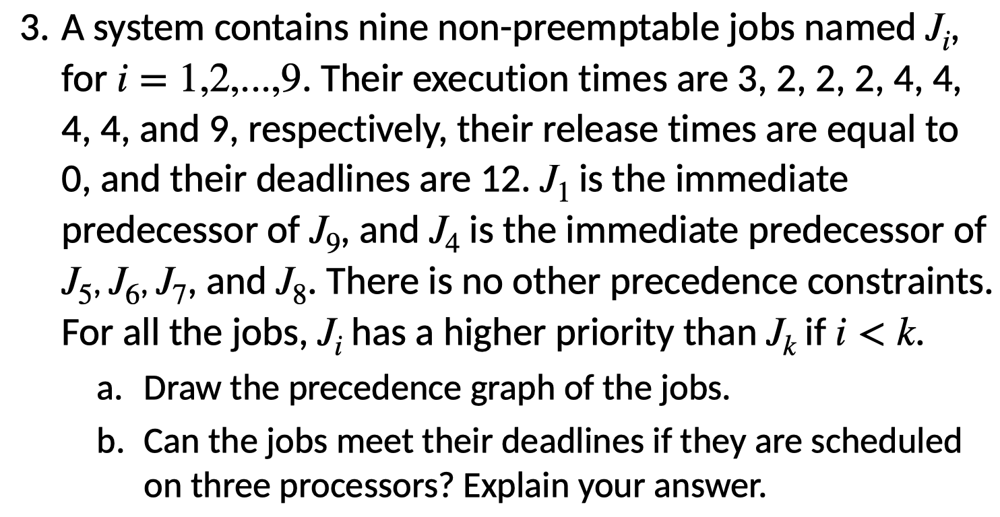
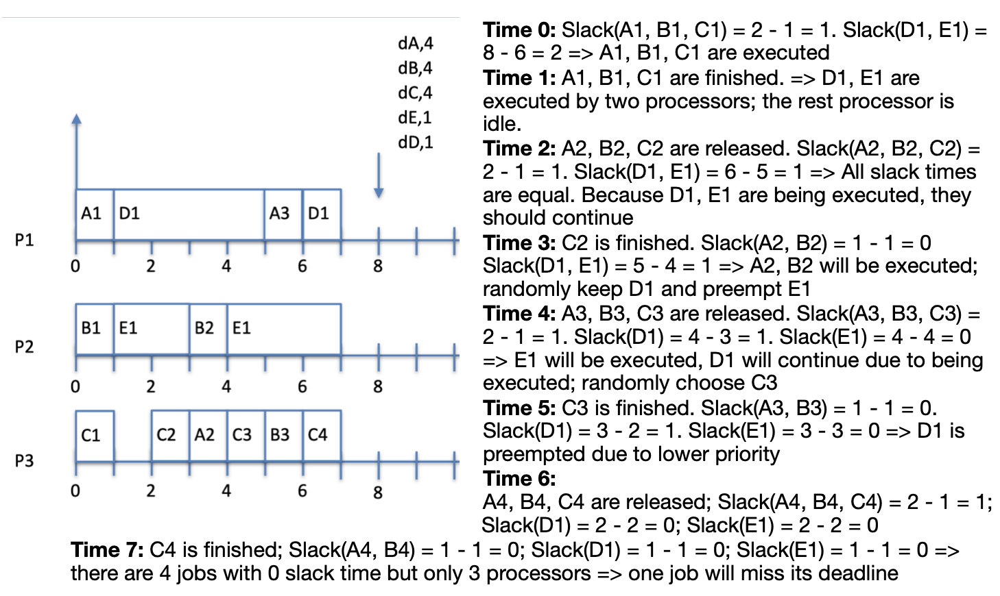
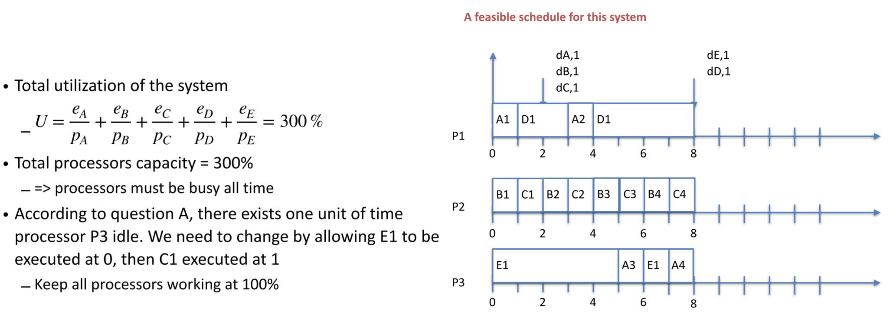
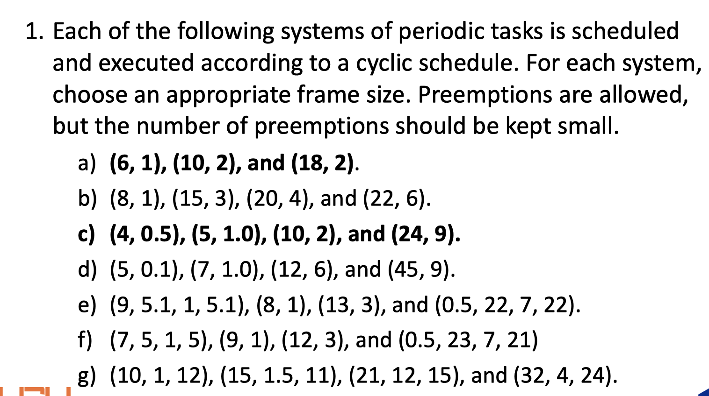
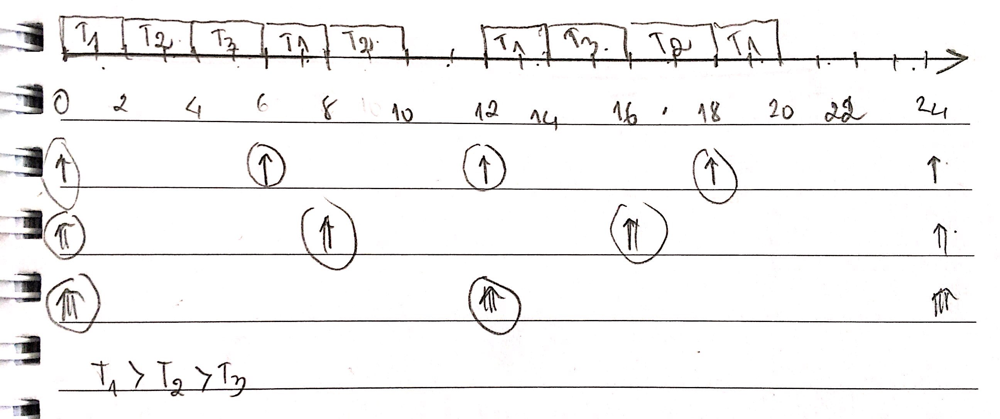
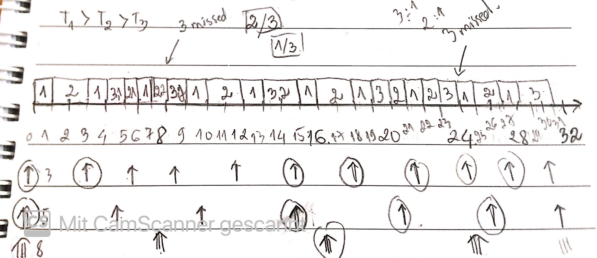
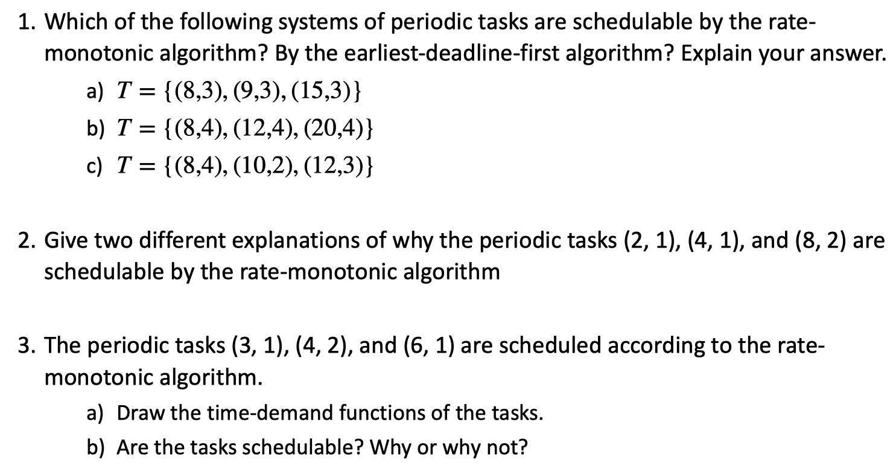

# Exercises

## Chapter 1

1. **Because sporadic jobs may have varying release times and execution times, the periodic task model may be too inaccurate and can lead to undue underutilization of the processor even when the inter release times of jobs are bounded from below and their executions are bounded from above. As an example, suppose we have a stream of sporadic jobs whose inter release times are uniformly distributed from 9 to 11. Their execution times are uniformly distributed from 1 to 3.**

   **a. What are the parameters of the periodic task if we were to use such a task to model the stream?**

   *For the peiodic task model we model a task using the lower bound on its period and the upper bound on its execution time (the worst case). In this case, the period, p = 9 and the execution time , e = 3.*

   **b. Compare the utilization of the periodic task in part (a) with the average utilization of the sporadic job stream.**

   

2. **Consider the real-time program described by the psuedo-code below. Names of jobs are in italic and green**:

   ```
   At 9AM, start: have breakfast 
   and 
   go to office; 
   At 10AM,
   	If there is class,
   		teach;
   		Else, help students; 
   When teach or help is done, eat lunch; 
   Until 2PM, sleep; 
   If there is a seminar,
   	If topic is interesting,
   		listen;
   		Else, read; 
   	Else write in office; 
   When seminar is over, attend 
   social hour; 
   discuss; 
   jog; 
   eat dinner; 
   work a little more; 
   end the day;
   ```

   *A. Draw a task graph to capture the dependencies among jobs.*

   

   *B. Use as many precedence graphs as needed to represent all the possible paths of the program*

   Vẽ hết tất cả các trường hợp của câu a.

## Chapter 2






### Solution

#### 1.

##### a.

   

##### b. 

   

##### c.

   


   J1 is the only job released at t=0, so it goes first.

   At t=1, J2, J4, and J7 have been released. J4 has a level of 3, so it goes first.

   At t=2, J4is done. J7 has the next highest level (2), so it goes next.

   At t=3, J7 is done. J3, J5, J8, and J9 are released. J5 has the next highest level (2), so it runs.

   At t=4, J5 is done. Either J2 or J8 could run because both have a level of 1 and both have had their precedence constraints met. At this point, J2 has already missed its deadline…

   At t=5, either J2 or J8, whichever was run at t=4, is done. The one that was not previously run gets to run. There are no more level 1 job.

   At t=6, J3, J6, and J9 are all eligible to run and are all at level 0. They can run in any order according to this scheduling algorithm.

   J2 and J3 miss their deadlines. This is \*not\* an optimal scheduling algorithm.

#### 2.
##### a.


##### b.


#### 3.
##### a.


##### b. **All jobs meet their deadline.**


##### 3. Extra:

**c)** Can the jobs meet their deadlines if we make them preemptable and schedule them preemptively? Explain your answer.

Sol: **Job J9 does not meet its deadline.**


**d)** Can the jobs meet their deadlines if they are scheduled non-preemptively on four processors? Explain your answer.

Sol: **Job J9 does not meet its deadline.**


**e)** Suppose that due to an improvement of the three processors, the execution time of every job is reduced by 1. Can the jobs meet their deadlines? Explain your answer.

Sol: **Job J9 does not meet its deadline.**


## Chapter 3




### Solution

#### 1. 

**a)** (6, 1), (10, 2), and (18, 2)


**b)** (8, 1), (15, 3), (20, 4), and (22, 6)


**c)** (4, 0.5), (5, 1.0), (10, 2), and (24, 9)


**d)** (5, 0.1), (7, 1.0), (12, 6), and (45, 9)


**e)** (5, 0.1), (7, 1.0), (12, 6), and (45, 9)


**f)** (7, 5, 1, 5), (9, 1), (12, 3), and (0.5, 23, 7, 21)


#### 2.
##### a. 


##### b. 


## Chapter 4.1


### Solution

#### 1. 

- T1(6,2); T2(8,2); T3(12,2). 

  LCM(6,8,12) = 24

  

#### 2.

a. Utilization =1/3 + 2/5 + 3/8 = 1.108

b. 

c. Task 3 cần 2 đơn vị thời gian, cần giảm task 1 minimum: 2/3 đơn vị thời gian.

#### 3.

## Chapter 4.2


### Solution - Trong giấy!

## Chapter 4.3



### Solution

#### 1.

##### a. T = {(8, 3), (9, 3), (15, 3)}


##### b. T = {(8, 4), (12, 4), (20, 4)}


##### c.  T = {(8, 4), (10, 2), (12, 3)}


#### 2. 

#### 3.

##### a.


##### b.


<<<<<<< Updated upstream
[http://et.engr.iupui.edu/~dskim/Classes/ESW5004/RTSys%20Lecture%20Note%20-%20ch04%20Clock-Driven%20Scheduling.pdf](http://et.engr.iupui.edu/~dskim/Classes/ESW5004/RTSys Lecture Note - ch04 Clock-Driven Scheduling.pdf)
=======
>>>>>>> Stashed changes
