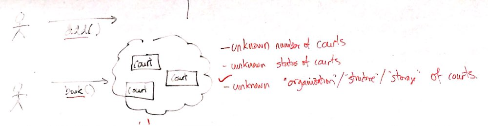

# Chain of Responsibility



#### Sceanario:

Có một chuỗi các courts, "client" muốn có 2 chức năng là book() và add(). Client không biết structure của ""đám mây courts" cũng như là trạng thái của court (đã được book hay chưa)

#### Solution:

Tổ chức "đám mây courts" thành chain. Mỗi court sẽ reference court tiếp theo. Sẽ có một entry court, gọi book() hoặc add() thông qua entry court, cho mỗi court  trong chuỗi, yêu cầu sẽ được xét xem là có thể thực hiện bởi court đó hay không, nếu không thì truyền yêu cầu cho court kế tiếp.

## Difference

Iterator: Client decides for booking or not.

CourtManager: the manager do the job

Chain: The court itself decides.


## Null Object


```
public void book() {
    if (status == true){
        System.out.println(name + " has been booked.");
        this.status = false;
    } else if (next != null){
        next.book();
    } else {
        System.out.println("All courts are busy. Book failed!");
    }
}
```

Change it to:

```java
public class Court implements ICourt {
    private String name;
    private boolean status;
    private ICourt next;

    public Court(String name) {
        this.name = name;
        this.status = true; // true = available
        this.next = NULL_OBJECT
    }
		@Override
    public void setNext(ICourt h) {
        this.next = h;
    }
    ...
}
```

```
public void book() {
    if (status == true){
        System.out.println(name + " has been booked.");
        this.status = false;
    } else next.book()
}
```

Next can be an object "Tour" or "Null Object". Null Object implements ICourt:

```java
public class NullCourt implements ICourt {
  @Override
  book(){
    sout("All courts are busy.");
  }
}
```

