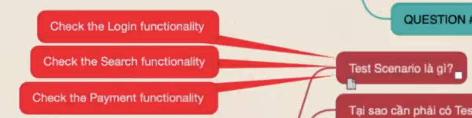
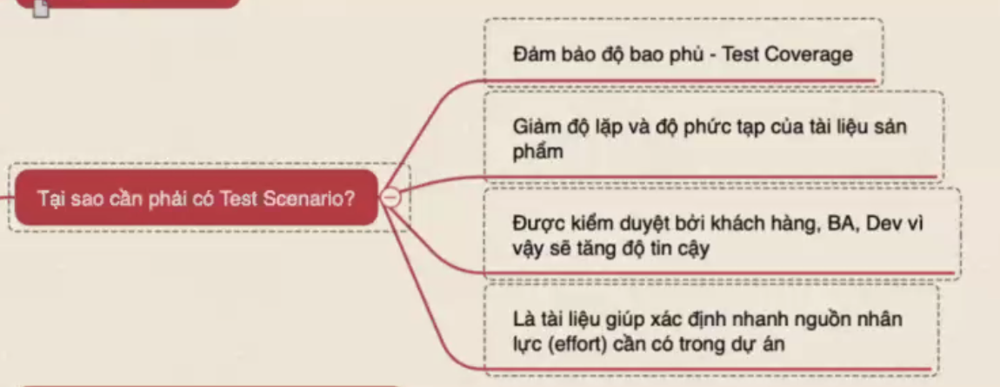
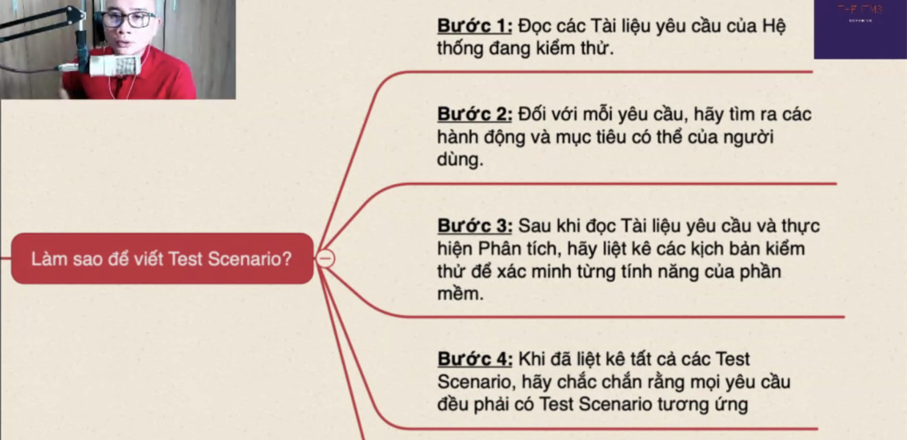
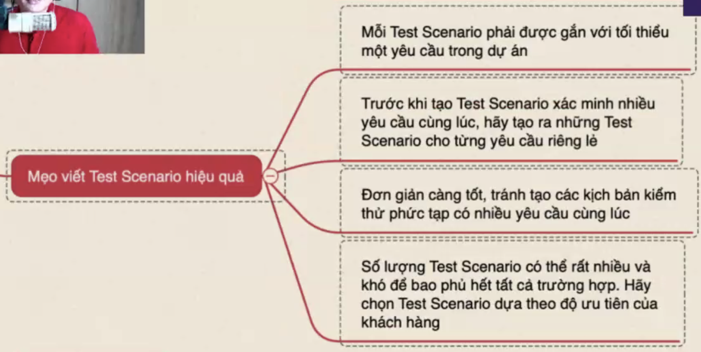
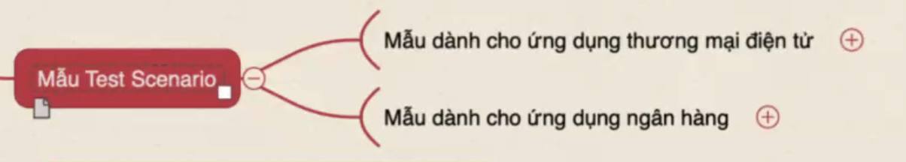
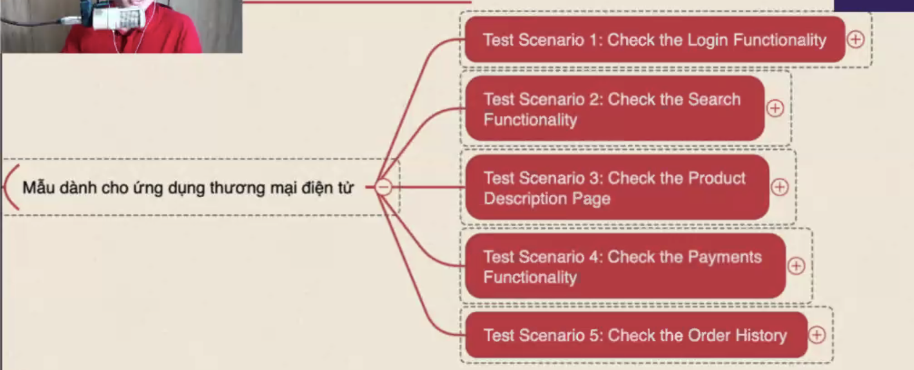
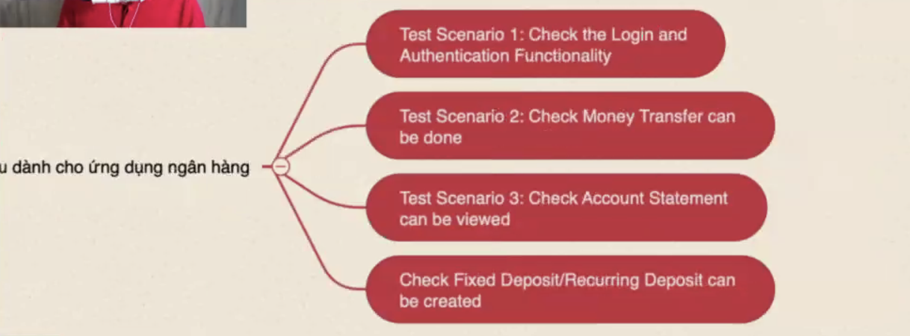
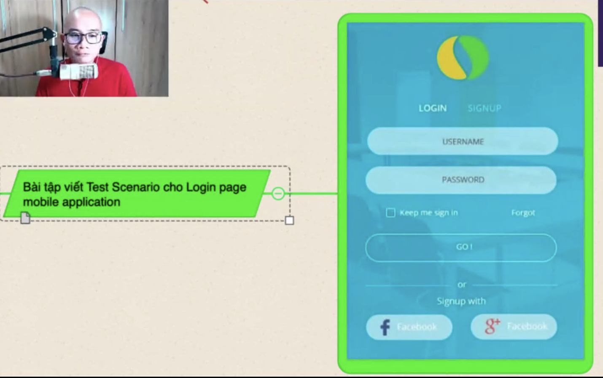

# 7 nguyên tắc kiểm thử phần mềm

1. Phát hiện ra lỗi

2.   
3. Kiểm thử toàn bộ là không thể

https://www.geeksforgeeks.org/software-engineering-seven-principles-of-software-testing/

# Test Scenario

là trường hợp kiểm thử, group các test case lại theo nhóm chức năng

## Test Scenario là gì?

## Tại sao cần Test Scenario

## Làm sao để viết Test Scenario

Bước 5: tiến hành tạo scenario và yêu cầu review vởi cấp trên và khách hàng

https://www.testrigtechnologies.com/25-test-scenarios-for-mobile-app-testing/

https://www.softwaretestingmaterial.com/test-scenarios-login-page/

https://www.softwaretestinghelp.com/login-page-test-cases/

https://www.guru99.com/testing-mobile-apps.html