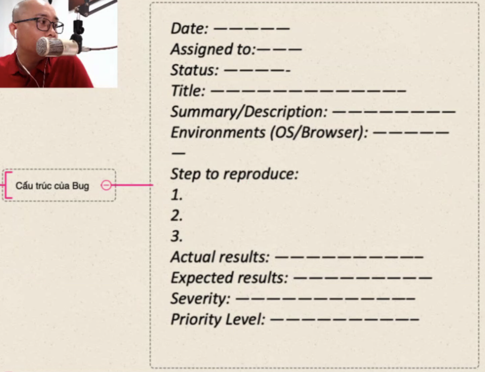
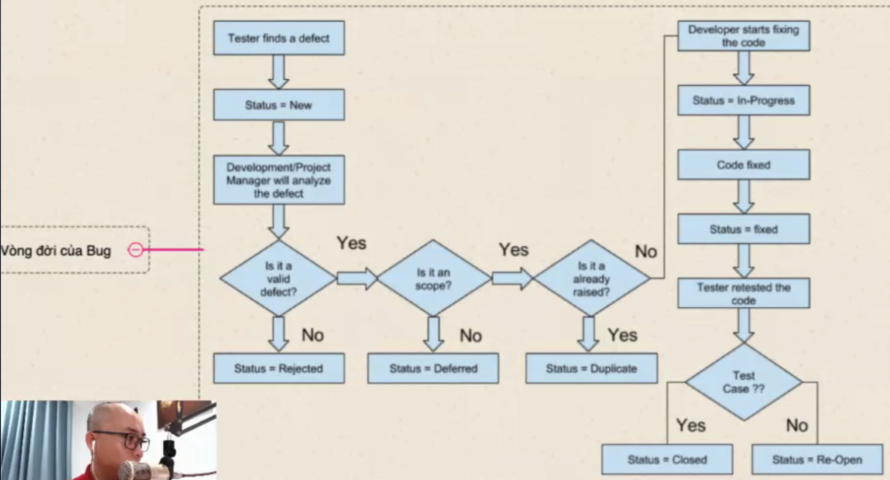
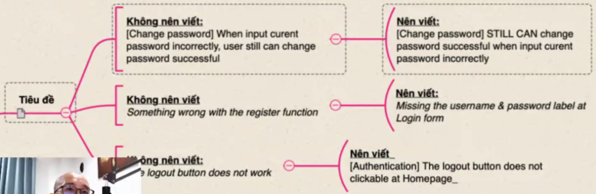
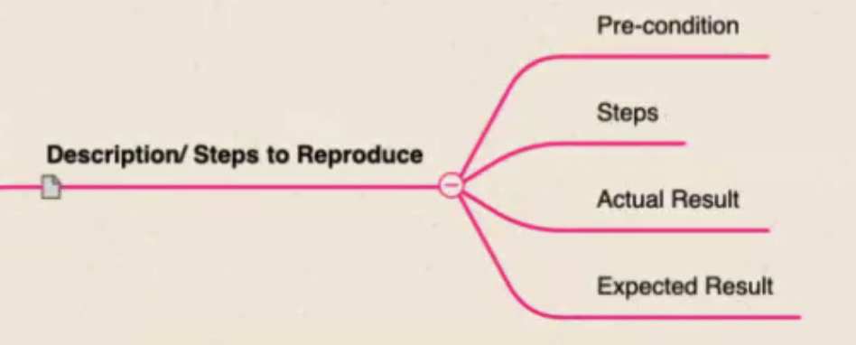
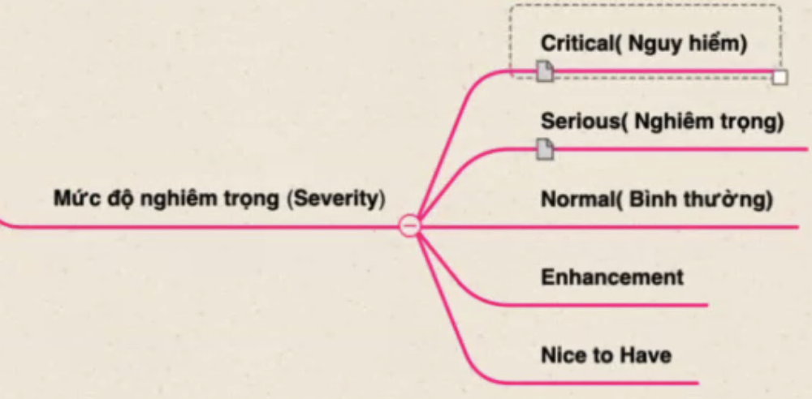
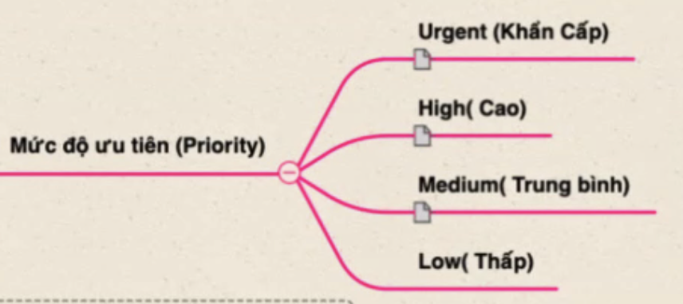

## Phần 5: Lỗi phần mềm

### Qui tắc xác định lỗi

### Cấu trúc của Bug

### Vòng đời của Bug

"Is it an scope": Nó có nằm trong phạm vi của dự án không?

### Lưu ý khi viết Bug

#### Tiêu đề

*the logout button...

[prefix] [lỗi gì] [khi nào lỗi ?] [screen nào lỗi ?]

prefix: màn hình / module

#### Mô tả

Cấm kị đưa lỗi bằng video. Trường hợp bất đắt dĩ thì video càng ngắn, càng trực quan càng tốt.

#### Môi trường kiểm thử

- Lỗi này ảnh hưởng đến hệ điều hành nào?
- Lỗi trình duyệt này ảnh hưởng gì?
- Lỗi này ảnh hưởng đến thiết bị nào?

#### Description/Steps to Reproduce

#### Mức độ nghiêm trọng

Nguy hiểm: sập server/ngừng hệ điều hành

Nghiêm trọng: Facebook hư nút Post

#### Mức độ ưu tiên

Nghiêm trọng CAO, ưu tiên THẤP: khi bug nghiêm trọng gặp ở sprint sau

#### Tài liệu đính kèm, bằng chứng

### Mẹo viết Bug

Tester là phải cẩn thận :v

